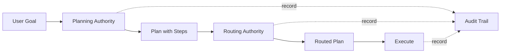

# Canonical Planning Authority

> **Status**: Canonical (2025-01-01)  
> **Owner**: Orchestration Team  
> **Related**: [ROUTING_AUTHORITY.md](ROUTING_AUTHORITY.md), [ORCHESTRATOR_CONTRACT.md](ORCHESTRATOR_CONTRACT.md)

## Overview

The Planning Authority is the single source of truth for **what to execute and in what order**. It works in coordination with Routing Authority (who executes) and Audit Trail (decision recording) to provide deterministic, observable orchestration.



## Key Principles

1. **Deterministic Planning**: Same inputs → same plan with explicit budgets
2. **Idempotent Transitions**: Plan→Route→Execute state machine with transition guards
3. **Budget Enforcement**: Tool budgets tracked and enforced throughout lifecycle
4. **Audit Trail**: All decisions recorded with reasoning for observability

## Architecture

### Planning Authority Interface

```python
from cuga.orchestrator import (
    PlanningAuthority,
    Plan,
    PlanStep,
    ToolBudget,
    BudgetError,
)

class PlanningAuthority(ABC):
    """Abstract planning authority interface."""
    
    @abstractmethod
    def create_plan(
        self,
        goal: str,
        trace_id: str,
        profile: str = "default",
        budget: Optional[ToolBudget] = None,
        constraints: Optional[Dict[str, Any]] = None,
    ) -> Plan:
        """Create execution plan for goal."""
        ...
    
    @abstractmethod
    def validate_plan(self, plan: Plan) -> bool:
        """Validate plan completeness and budget sufficiency."""
        ...
```

### Plan State Machine

Plans transition through explicit lifecycle stages with validation:

```
CREATED → ROUTED → EXECUTING → COMPLETED
           ↓          ↓            ↓
       CANCELLED  CANCELLED    FAILED
```

**Valid Transitions**:
- `CREATED` → `ROUTED`, `CANCELLED`
- `ROUTED` → `EXECUTING`, `CANCELLED`
- `EXECUTING` → `COMPLETED`, `FAILED`, `CANCELLED`
- Terminal states (`COMPLETED`, `FAILED`, `CANCELLED`) cannot transition

**Transition Guards**:
```python
plan = Plan(
    plan_id="plan-123",
    goal="search for data",
    steps=[...],
    stage=PlanningStage.CREATED,
    budget=ToolBudget(),
    trace_id="trace-1",
)

# Valid transition
routed_plan = plan.transition_to(PlanningStage.ROUTED)

# Invalid transition raises ValueError
try:
    plan.transition_to(PlanningStage.EXECUTING)  # Cannot skip ROUTED
except ValueError as e:
    print(f"Invalid transition: {e}")
```

## Tool Budget Enforcement

### Budget Structure

```python
@dataclass(frozen=True)
class ToolBudget:
    """Immutable tool budget tracking."""
    
    cost_ceiling: float = 100.0      # Maximum cost allowed
    cost_spent: float = 0.0          # Cost consumed so far
    call_ceiling: int = 50           # Maximum tool calls allowed
    call_spent: int = 0              # Tool calls consumed
    token_ceiling: int = 100000      # Maximum tokens allowed
    token_spent: int = 0             # Tokens consumed
    policy: str = "warn"             # "warn" or "block"
```

### Budget Tracking

```python
# Initial budget
budget = ToolBudget(
    cost_ceiling=100.0,
    call_ceiling=10,
    token_ceiling=10000,
    policy="block",
)

# Track consumption (immutable updates)
budget = budget.with_cost(5.0)       # Add cost
budget = budget.with_call()          # Increment call count
budget = budget.with_tokens(100)     # Add tokens

# Check limits
if not budget.within_limits():
    raise BudgetError("Budget exceeded")

# Query remaining budget
remaining_cost = budget.remaining_cost()
remaining_calls = budget.remaining_calls()
remaining_tokens = budget.remaining_tokens()
```

### Budget Enforcement in Planning

```python
planner = ToolRankingPlanner(max_steps=5)

tools = [
    {"name": "tool1", "cost": 60.0, "tokens": 5000},
    {"name": "tool2", "cost": 0.1, "tokens": 10},
]

budget = ToolBudget(cost_ceiling=10.0, token_ceiling=1000)

try:
    plan = planner.create_plan(
        "expensive operation",
        trace_id="trace-1",
        budget=budget,
        constraints={"available_tools": tools},
    )
except BudgetError as e:
    print(f"Insufficient budget: {e.required_cost} > {e.available_cost}")
```

## Tool Ranking Planner

Default implementation using keyword overlap scoring:

```python
from cuga.orchestrator import ToolRankingPlanner, create_planning_authority

# Create planner
planner = ToolRankingPlanner(
    max_steps=10,
    default_budget=ToolBudget(cost_ceiling=100.0),
)

# Or use convenience function
planner = create_planning_authority(max_steps=10)

# Create plan
plan = planner.create_plan(
    goal="search web for Python documentation",
    trace_id="trace-123",
    profile="research",
    constraints={
        "available_tools": [
            {
                "name": "cuga.modular.tools.web_search",
                "description": "Search the web for information",
                "cost": 1.0,
                "tokens": 100,
            },
            {
                "name": "cuga.modular.tools.rag_query",
                "description": "Query RAG knowledge base",
                "cost": 0.5,
                "tokens": 50,
            },
        ]
    },
)

# Plan structure
print(f"Plan ID: {plan.plan_id}")
print(f"Goal: {plan.goal}")
print(f"Steps: {len(plan.steps)}")
print(f"Estimated cost: {plan.estimated_total_cost()}")
print(f"Budget sufficient: {plan.budget_sufficient()}")

# Validate plan
planner.validate_plan(plan)
```

## Integration with Routing Authority

Planning and routing work together for complete orchestration:

```python
from cuga.orchestrator import (
    create_planning_authority,
    create_routing_authority,
    RoutingCandidate,
    RoutingContext,
)

# 1. Create plan (what to do)
planner = create_planning_authority(max_steps=5)
plan = planner.create_plan("search and summarize", trace_id="trace-1")

# 2. Route workers to steps (who does it)
router = create_routing_authority(worker_strategy=RoutingStrategy.ROUND_ROBIN)

workers = [
    RoutingCandidate(id="w1", name="worker-1", type="worker"),
    RoutingCandidate(id="w2", name="worker-2", type="worker"),
]

routed_steps = []
for step in plan.steps:
    context = RoutingContext(
        trace_id=plan.trace_id,
        profile=plan.profile,
        task=step.tool,
    )
    
    decision = router.route_to_worker(context, workers)
    
    # Assign worker to step
    step.worker = decision.selected.id
    routed_steps.append(step)

# 3. Update plan with routing
plan = plan.with_routed_steps(routed_steps)
plan = plan.transition_to(PlanningStage.ROUTED)

# 4. Execute (not shown - see ORCHESTRATOR_CONTRACT.md)
```

## Audit Trail Integration

All planning decisions are recorded for observability:

```python
from cuga.orchestrator import create_audit_trail

# Create audit trail (SQLite or JSON backend)
audit = create_audit_trail(
    backend_type="sqlite",
    storage_path="audit/decisions.db",
)

# Record plan creation
plan = planner.create_plan("test goal", trace_id="trace-1")
audit.record_plan(plan, stage="plan_created")

# Record each step
for step in plan.steps:
    audit.record_plan_step(
        plan_id=plan.plan_id,
        trace_id=plan.trace_id,
        step=step,
        stage="step_selected",
    )

# Query audit history
history = audit.get_trace_history("trace-1")
for record in history:
    print(f"{record.timestamp}: {record.stage} → {record.target}")
    print(f"  Reason: {record.reason}")

# Query by decision type
planning_history = audit.get_planning_history(limit=100)
routing_history = audit.get_routing_history(limit=100)
```

## Testing Requirements

All planning implementations MUST pass these tests:

### 1. Determinism

```python
def test_deterministic_planning():
    """Same inputs produce same plan."""
    planner = ToolRankingPlanner()
    
    plan1 = planner.create_plan("goal", trace_id="t1", constraints={"tools": tools})
    plan2 = planner.create_plan("goal", trace_id="t2", constraints={"tools": tools})
    
    # Same tool selection and order
    assert [s.tool for s in plan1.steps] == [s.tool for s in plan2.steps]
```

### 2. Idempotency

```python
def test_idempotent_transitions():
    """Repeated valid transitions are safe."""
    plan = Plan(...)
    
    # Can transition multiple times
    routed1 = plan.transition_to(PlanningStage.ROUTED)
    
    # Cannot re-transition same instance
    with pytest.raises(ValueError):
        routed1.transition_to(PlanningStage.ROUTED)
```

### 3. Budget Enforcement

```python
def test_budget_enforcement():
    """Plans respect budget constraints."""
    planner = ToolRankingPlanner()
    budget = ToolBudget(cost_ceiling=10.0)
    
    expensive_tools = [{"name": "t1", "cost": 100.0}]
    
    with pytest.raises(BudgetError) as exc:
        planner.create_plan("goal", "trace-1", budget=budget, 
                           constraints={"available_tools": expensive_tools})
    
    assert exc.value.required_cost > budget.cost_ceiling
```

### 4. Audit Persistence

```python
def test_audit_persistence():
    """Decisions persist and are queryable."""
    audit = create_audit_trail(backend_type="sqlite")
    
    plan = planner.create_plan("goal", trace_id="trace-1")
    audit.record_plan(plan)
    
    history = audit.get_trace_history("trace-1")
    assert len(history) >= 1
    assert history[0].target == plan.plan_id
```

## Environment Configuration

Configure planning and audit via environment variables:

```bash
# Audit storage (default: audit/decisions.db for SQLite, audit/decisions.jsonl for JSON)
export CUGA_AUDIT_PATH="path/to/audit.db"

# Budget defaults
export AGENT_BUDGET_CEILING=100
export AGENT_BUDGET_POLICY=warn  # or "block"

# Planning constraints
export PLANNER_MAX_STEPS=10
```

## Migration Guide

### From Legacy Planner

**Before**:
```python
from cuga.modular.agents import PlannerAgent

planner = PlannerAgent(registry, memory, config)
plan = planner.plan(goal, metadata)  # Returns AgentPlan
```

**After**:
```python
from cuga.orchestrator import create_planning_authority

planner = create_planning_authority(max_steps=config.max_steps)
plan = planner.create_plan(
    goal,
    trace_id=metadata["trace_id"],
    profile=metadata.get("profile", "default"),
    budget=ToolBudget(cost_ceiling=config.budget_ceiling),
)
```

### Key Differences

1. **Explicit Budget**: Legacy planner had implicit budget tracking; new planner requires explicit `ToolBudget`
2. **State Machine**: Legacy planner had no lifecycle; new planner enforces Plan→Route→Execute transitions
3. **Audit Trail**: Legacy planner had trace list; new planner persists decisions in queryable backend
4. **Determinism**: Legacy planner ranking was implicit; new planner guarantees deterministic tool selection

## See Also

- [ROUTING_AUTHORITY.md](ROUTING_AUTHORITY.md) - Routing decisions and worker selection
- [ORCHESTRATOR_CONTRACT.md](ORCHESTRATOR_CONTRACT.md) - Full orchestration lifecycle
- [FAILURE_MODES.md](FAILURE_MODES.md) - Error handling and retry policies
- [EXECUTION_CONTEXT.md](EXECUTION_CONTEXT.md) - Execution context propagation
